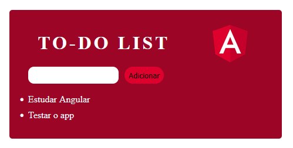

<h1 align="center"> To-Do List - Angular</h1>

Simples To-Do List feita em Angular com intuito de estudos

<h2>🚀 Tecnologias utilizadas: </h2>

- HTML
- CSS
- TypeScript
- Angular

<h2> 🎯 Coisas a adicionar: </h2>

- Botão de Check e Remove Task
- Salvar em local-storage

<h2>🚀 O que foi estudado: </h2>

- Templates e Variáveis
- Loop
- Classes
- Condicionais
- Bind de Propriedades
- Styles e Class
- Eventos de Clique e Teclado
- Variável Auxiliar

<h2>📝 Licença</h2>
Esse projeto está sob a licença MIT. Veja o arquivo LICENSE para mais detalhes.
